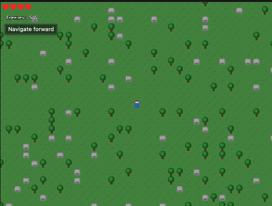

# Wild Adventure

A top-down Zelda-like action-adventure prototype built with **Phaser 4** (RC) and bundled with **Vite**. (See PHASER4_MIGRATION.md for migration details.)



Move around a procedurally generated overworld, fight goblins with your sword, collect hearts, and survive.

## Controls

| Input | Action |
|---|---|
| WASD / Arrow keys | Move (8-directional, animations snap to 4 cardinal) |
| Space | Sword attack (directional, 1 s cooldown) |
| R | Restart (on game over or victory screen) |
| Touch (mobile) | Left 70 % of screen = virtual joystick, right 30 % = attack |

## Getting Started

```bash
# Install dependencies
npm install

# Start the dev server (hot-reload)
npm run dev
```

Open **http://localhost:5173** in your browser.

## Building for Production

```bash
npm run build      # outputs to dist/
npm run preview    # serves dist/ at http://localhost:4173
```

Both the dev and preview servers bind to `0.0.0.0`, so they're accessible from other machines on the network (useful inside containers or VMs).

## Development, Testing & Coverage

The project is now fully TypeScript (`*.ts` sources with `tsconfig.json`; Vite transpiles seamlessly). To protect against regressions:

```bash
npm run type-check  # tsc --noEmit
npm test            # vitest watch mode
npm run test:run    # CI-style run
npm run test:coverage  # Generates V8 coverage report (console + HTML/JSON in ./coverage/; ~69% now, utils high via extracts; excludes tests/mocks)
npm run test:ui     # Vitest UI dashboard
```

- **File convention**: `<target>.test.ts` (e.g., `gameSceneUtils.test.ts` tests `gameSceneUtils.ts`).
- **Refactors**: Extracted non-UI logic to `gameSceneUtils.ts` (effects/AI/math for readability/tests) + `types.ts` (shared Phaser types); GameScene thinned for maintainability.
- **Mocks**: Vitest/jsdom + setup for Phaser (enables unit tests on UI-heavy code).

- **Coverage**: Use report to prioritize (e.g., GameScene next).

## Project Structure

```
wild-adventure/
├── index.html              Vite entry point
├── package.json
├── vite.config.ts
├── tsconfig.json           TypeScript config
├── tsconfig.node.json      For Vite config
├── public/                 Static assets (drop PNGs here)
└── src/
    ├── main.ts             Phaser boot & game config
    ├── constants.ts        Tunable gameplay constants & sprite frame map
    ├── map.ts              Procedural 50×50 tilemap generator
    ├── fallbacks.ts        Auto-generated textures when PNGs are missing
    ├── gameSceneUtils.ts   Extracted non-UI utils (effects/AI/math)
    ├── types.ts            Shared TS types (GameEnemy, etc.)
    ├── style.css           Minimal fullscreen styles
    └── scenes/
        └── GameScene.ts    Main game scene (player, enemies, combat, UI)
```

## Assets

The game auto-generates coloured placeholder textures at runtime, so **no image files are required to play**. If you want to swap in real pixel art, drop the following PNGs into `public/`:

| File | Size | Description |
|---|---|---|
| `player_sheet.png` | 512×512 | Spritesheet — 32×32 frames, 16 columns (see `constants.ts` for the frame map) |
| `grass.png` | 32×32 | Grass tile |
| `tree.png` | 32×32 | Tree tile (impassable) |
| `rock.png` | 32×32 | Rock tile (impassable) |
| `goblin.png` | 32×32 | Goblin sprite |
| `heart_full.png` | 16×16 | Full heart icon |
| `heart_empty.png` | 16×16 | Empty heart icon |

### AI Prompts for Generating Assets

- *"Pixel art 32×32 top-down hero sprite sheet, 16 columns, walk/idle/attack in 4 directions, transparent background, Zelda LTTP style"*
- *"Pixel art 32×32 goblin sprite, top-down, green skin, red eyes, Zelda style"*
- *"Pixel art 32×32 seamless grass/tree/rock tiles, top-down RPG"*
- *"Pixel art 16×16 heart icon, red fill, black outline"*

## Gameplay

- **Overworld**: 50×50 tile map (~80 % grass, ~12 % trees, ~8 % rocks) with carved cross-paths and a tree border wall.
- **Player**: 4 hearts (96 HP). Takes 24 damage per enemy touch. 0.8 s invincibility after each hit with knockback.
- **Enemies**: The world contains a mix of goblins, wizrobes, and a lynel miniboss. Goblins patrol randomly and chase the player if they come within 128 px; they die in one sword hit and drop a heart pickup (+24 HP). Wizrobes teleport between set points, periodically casting ranged magic projectiles at the player, and are vulnerable to sword attacks. The lynel is tougher, pursuing the player aggressively, using both melee charges and powerful ranged attacks, and requires multiple hits to defeat. The exact composition and number of each enemy type may vary from game to game.
- **Win condition**: Defeat all 5 enemies.
- **Lose condition**: HP reaches 0.

## License

MIT
